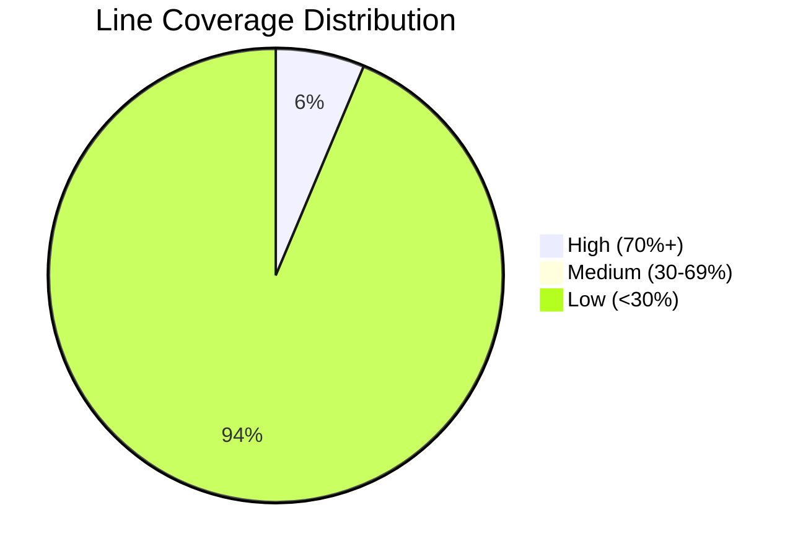

## Code Coverage Report

### Summary Metrics
| Metric                | Value   | Coverage % |
|-----------------------|---------|------------|
| **Line Coverage**     | 189/7664 | 2.4%       |
| **Branch Coverage**   | 37/1664  | 2.2%       |
| **Classes**           | 79       | -          |
| **Files**             | 86       | -          |

### Key Components Coverage

#### High Coverage (70%+)
| Component | Type | Line Coverage | Branch Coverage |
|-----------|------|---------------|------------------|
| `ReservationCleanupService` | Service | 94.7% | 70.8% |
| `EmailTemplateService` | Service | 78.0% | 83.3% |
| `Flight` | Model | 96.0% | 100% |
| `Reservation` | Model | 92.8% | 100% |
| `ReservationUser` | Model | 91.6% | - |

#### Core Components
| Component | Type | Line Coverage | Branch Coverage |
|-----------|------|---------------|------------------|
| `ApplicationDbContext` | Database | 100% | 100% |
| `AdminController` | Controller | 0% | 0% |
| `FlightsController` | Controller | 0% | 0% |
| `ReservationsController` | Controller | 0% | 0% |
| `BrevoEmailService` | Service | 0% | 0% |

### Risk Hotspots (High Complexity)
| Component | CRAP Score | Cyclomatic Complexity |
|-----------|------------|-----------------------|
| `Views_Reservations_Index.ExecuteAsync()` | 12,656 | 112 |
| `Views_ReservationUsers_Index.ExecuteAsync()` | 12,210 | 110 |
| `Views_Admin_Index.ExecuteAsync()` | 10,920 | 104 |
| `Views_Flights_Index.ExecuteAsync()` | 8,930 | 94 |
| `ReservationsController.Create()` | 1,332 | 36 |

### Coverage Trends

