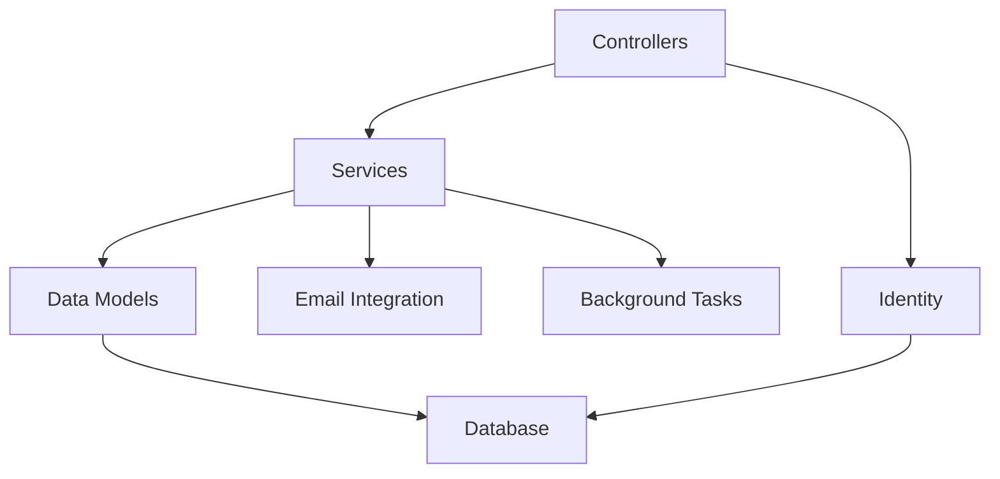

# ✈️ FlightManager - Modern Flight Management System

A full-featured ASP.NET Core application for managing flights, reservations, and user administration with clean architecture and robust validation.

## ✨ Core Functionality

### Flight Management
- Create, edit and track flights with capacity monitoring
- Smart filtering and autocomplete for flight search
- Capacity validation (BusinessClass ≤ PassengerCapacity)
- Time validation (ArrivalTime > DepartureTime)

### Reservation System
- **Email Confirmation Workflow**:
  ```mermaid
  sequenceDiagram
      User->>Controller: Create Reservation
      Controller->>EmailService: Send Confirmation
      EmailService->>User: Email with Token
      User->>Controller: Confirm via Token
      Controller->>Database: Mark Confirmed
  ```
- Supports both registered users and guest reservations
- Automatic cleanup of unconfirmed reservations after 24h
- Business/Regular class ticket options

### User Administration
- Complete user and role management
- Paginated role lists with user counts
- Secure user creation with role assignments

## 🔒 Security & Validation
- ASP.NET Core Identity integration
- Comprehensive model validation
- Automatic cleanup of orphaned records
- Unique reservation enforcement
- Email token verification system

## 📊 Data Management
- SQL Database support with Entity Framework Core
- Intelligent relationship handling:
  ```mermaid
  erDiagram
      FLIGHT ||--o{ RESERVATION : has
      RESERVATION }|--|| RESERVATION_USER : belongs_to
  ```
- Enum storage as strings (TicketType: Regular, BusinessClass)
- Automatic timestamping (CreatedAt fields)

## 🏗️ Architecture



## 🛠️ Installation

1. Clone the repository
   ```bash
   git clone https://github.com/f8developer/FlightManager.git
   ```
2. Configure database connection in `appsettings.json`
3. Set up required services in `credentials.json`:
   ```yaml
   EmailService:
     ApiKey: "your_brevo_api_key"
   ```
4. Configure owner settings:
   ```yaml
   OwnerEmail: "admin@example.com"
   OwnerPassword: "SecurePassword123!"
   ```
5. Run migrations
   ```bash
   dotnet ef database update
   ```
6. Run FlightManager
   ```bash
   dotnet run
   ```

## 🧪 Testing

The project includes comprehensive unit tests covering:
- Database operations
- Model validation (date ordering, capacity rules)
- Business logic (reservation uniqueness)
- Email template handling
- Orphan removal logic

For detailed code coverage information, see [CodeCoverage.md](CodeCoverage.md).

Run tests with:
```bash
dotnet test
```

## 📄 Documentation

Full system documentation available in the [MAIN.md](/docs/MAIN.md) file, including:
- Core components architecture
- Controller specifications
- Data model details
- Service implementations
- Database layer configuration

## 🤝 Contributing

We welcome contributions! Please follow our [contribution guidelines](CONTRIBUTING.md).

## 📜 License

GNU Public License - See [LICENSE](LICENSE) for details.

---
<div align="center">
  <h1>Elevating Flight Management to New Heights</h1>
</div>
