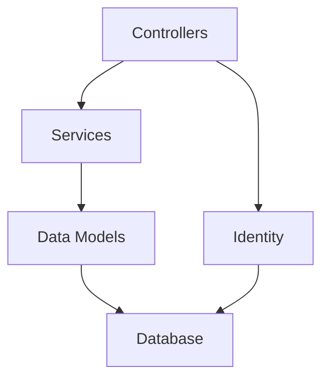

# ✈️ FlightManager - Modern Flight Management System

A full-featured ASP.NET Core application for managing flights, reservations, and user administration with clean architecture and robust validation.

## 🚀 Features

### ✨ Core Functionality
- **Flight Management** - Create, edit and track flights with capacity monitoring
- **Reservation System** - Book passengers with business/regular class options
- **User Administration** - Complete user and role management

### 🔒 Security & Validation
- ASP.NET Core Identity integration
- Comprehensive model validation
- Automatic cleanup of orphaned records
- Unique reservation enforcement

### 📊 Data Management
- SQL Database support
- Intelligent relationship handling
- Enum storage with proper conversion

## 🏗️ Architecture



## 🛠️ Installation

1. Clone the repository
   ```bash
   git clone https://github.com/yourusername/FlightManager.git
   ```
2. Configure database connection in `appsettings.json`
3. Set up admin credentials in `secrets.json`
4. Run migrations
   ```bash
   dotnet ef database update
   ```

## 🧪 Testing

The project includes comprehensive unit tests covering:

- Database operations
- Model validation
- Business logic

Run tests with:
```bash
dotnet test
```

## 📄 Documentation

Full API documentation available in the [docs](/docs/MAIN.md) folder.

## 🤝 Contributing

We welcome contributions! Please follow our [contribution guidelines](CONTRIBUTING.md).

## 📜 License

GNU Public License - See [LICENSE](LICENSE) for details.

--
<div align="center">
  <h1>Elevating Flight Management to New Heights</h1>
</div>
