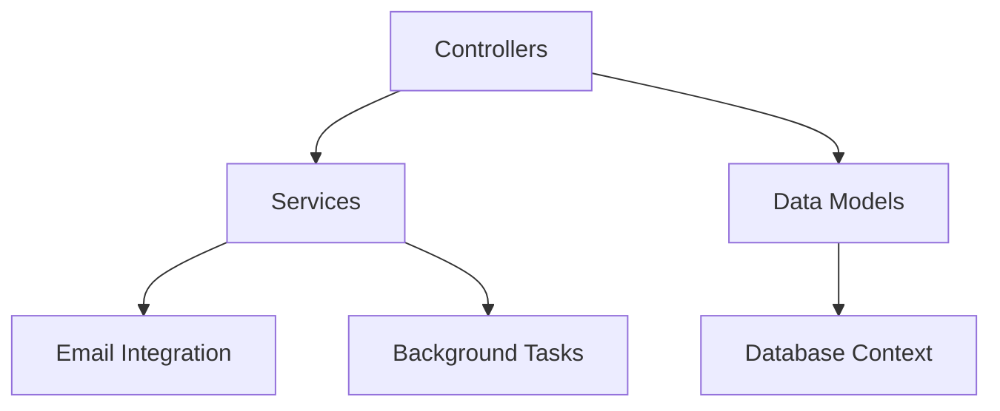
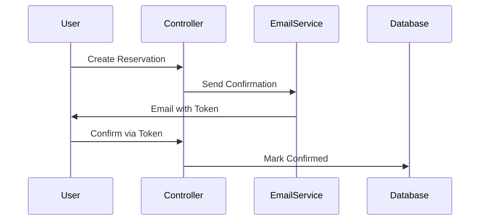
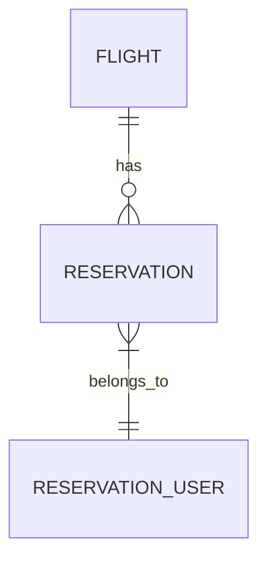
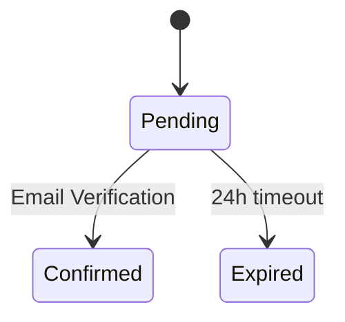
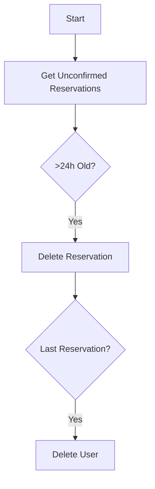
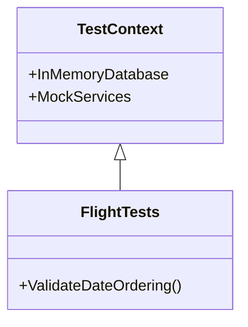

# FlightManager System Documentation

## Table of Contents
1. [Core Components](#core-components)
2. [Controllers](#controllers)
3. [Data Models](#data-models)
4. [Services](#services)
5. [Database Layer](#database-layer)
6. [Configuration](#configuration)
7. [Testing](#testing)

---

## Core Components

### Application Structure


---

## Controllers

### AdminController
**Responsibilities**: User and role management

| Method | Parameters | Description | Exceptions |
|--------|------------|-------------|------------|
| `Roles()` | `pageNumber`, `pageSize` | Paginated role list with user counts | - |
| `CreateUser()` | `AppUser`, password, roles | Creates user with role assignments | `InvalidOperationException` |
| `DeleteRole()` | `roleId` | Removes role if unused | `InvalidOperationException` |

### FlightsController
**Features**: Flight operations with smart filtering

| Method | Key Functionality |
|--------|-------------------|
| `GetLocationSuggestions()` | Autocomplete for flight search |
| `Passengers()` | Paginated passenger manifests |
| `Create()` | Flight creation with capacity validation |

### ReservationsController
**Workflows**:


### ReservationUsersController
**Special Cases**:
- Handles both registered users and guest reservations
- Automatic cleanup of orphaned records

---

## Data Models

### Flight Entity
**Properties**:
- Required: `FromLocation`, `ToLocation`, `PilotName`
- Validation: `ArrivalTime > DepartureTime`
- Capacity: `BusinessClassCapacity ≤ PassengerCapacity`

**Relationships**:


### Reservation System
**States**:


### Enums
- `TicketType`: `Regular`, `BusinessClass`

---

## Services

### Email Services

#### BrevoEmailService
**Features**:
- API Key: Loaded from `credentials.json`
- Methods: `SendEmail()`, `ConvertHtmlToPlainText()`
- Templates: Uses `EmailTemplateService`

#### EmailTemplateService
**Workflow**:
1. Loads HTML templates from `/Templates`
2. Replaces placeholders (`{PropertyName}`)
3. Falls back to plain text

### Background Services

#### ReservationCleanupService
**Logic Flow**:


---

## Database Layer

### ApplicationDbContext
**Key Configurations**:
- Automatic timestamping (`CreatedAt`)
- Orphaned user cleanup
- Enum storage as strings

**Migrations**:
1. `AddReservationConfirmation`: Added token system
2. `AddReservationTimestamps`: Created audit fields

---

## Configuration

### OwnerSettings
```yaml
OwnerEmail: "admin@example.com"
OwnerPassword: "SecurePassword123!" # Required
```

### ReservationCleanupSettings
```yaml
CleanupIntervalHours: 1
ReservationExpiryHours: 24
```

---

## Testing

### Test Coverage

| Test Class | Key Validations |
|------------|-----------------|
| `FlightTests` | Date ordering, capacity rules |
| `ReservationTests` | Uniqueness constraints |
| `EmailServiceTests` | Template handling |
| `CleanupServiceTests` | Orphan removal logic |

### Test Architecture
